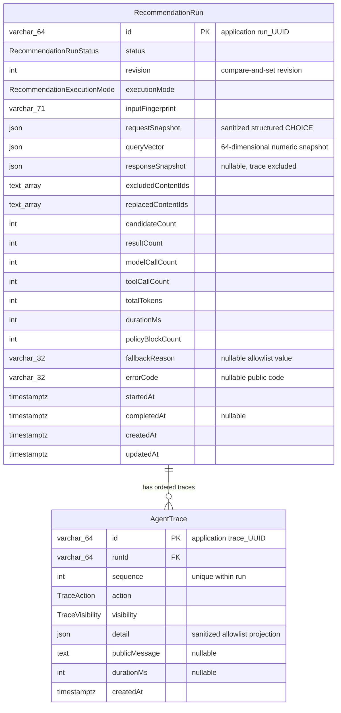

# OTT 다모아 v0.6 Run·Trace ERD baseline

이 문서는 `OTT-DAMOA-MVP-v0.6.md`와
`BACKEND-SPRINT-OWNERSHIP-v0.7.md`의 활성 영속 계약을 표현한다.
`prisma/schema.prisma`와 동일하게 비식별 추천 실행과 append-only Trace만
포함한다.

관계와 제약:

- `RecommendationRun.id`와 `AgentTrace.runId`는 `VarChar(64)`이며
  `run_<UUID>` opaque ID를 지원한다.
- `AgentTrace`는 `[runId, sequence]` unique 제약으로 Run별 순서를 보장한다.
- Run 삭제 시 소속 Trace만 cascade 삭제된다. 일반 서비스에는 삭제 기능이
  없고 memory Demo reset만 별도 capability로 제공한다.
- User·Profile·Auth·Engagement·Catalog relation이나 모델은 없다.
- 자연어 원문, token, matched terms, prompt, secret, 개인 식별자는 어느
  snapshot이나 Trace에도 저장하지 않는다.
